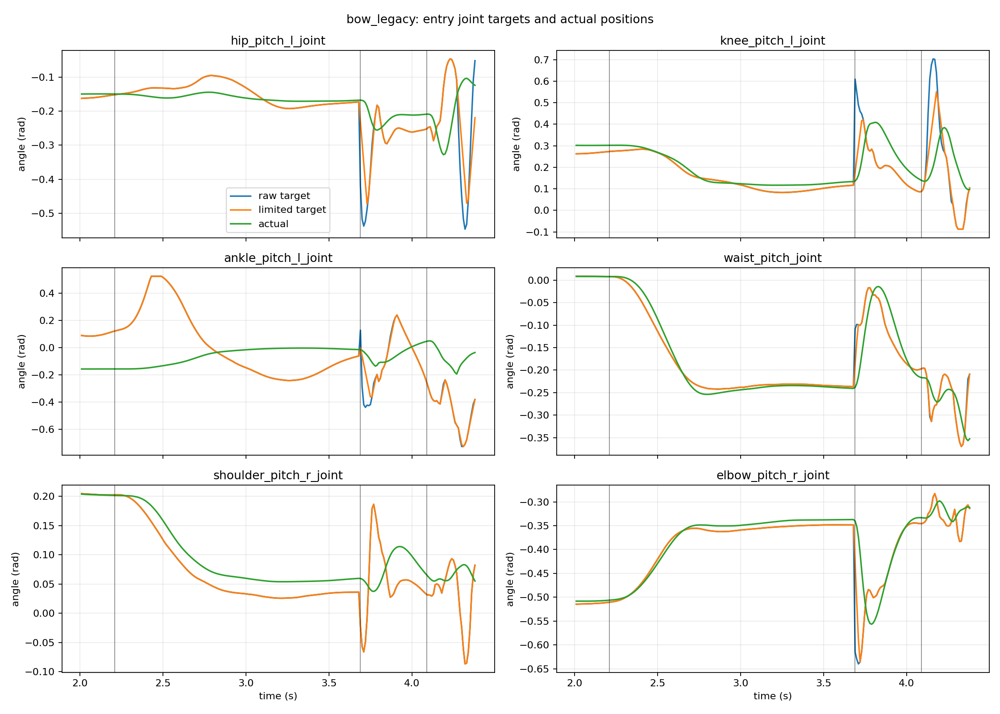
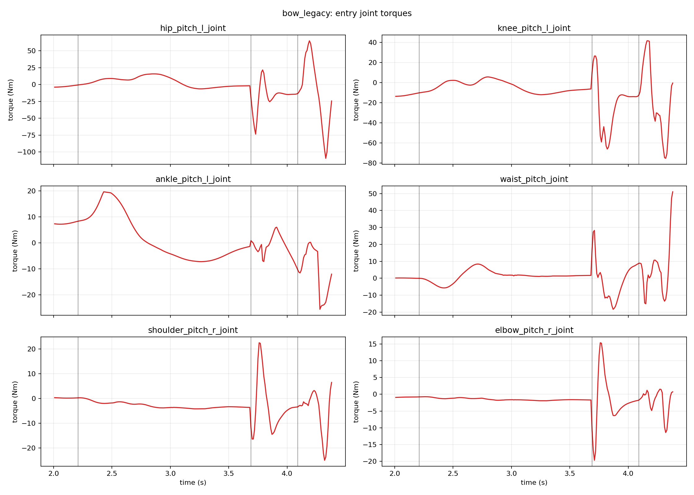
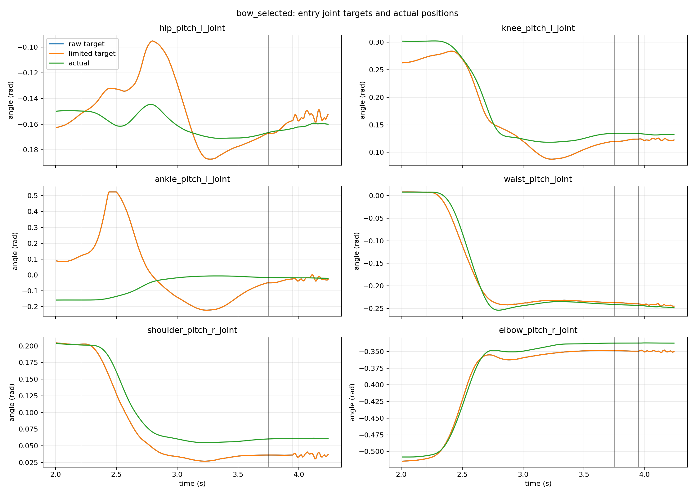
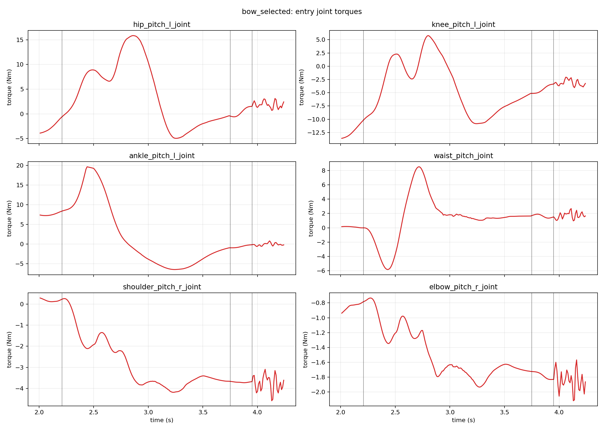
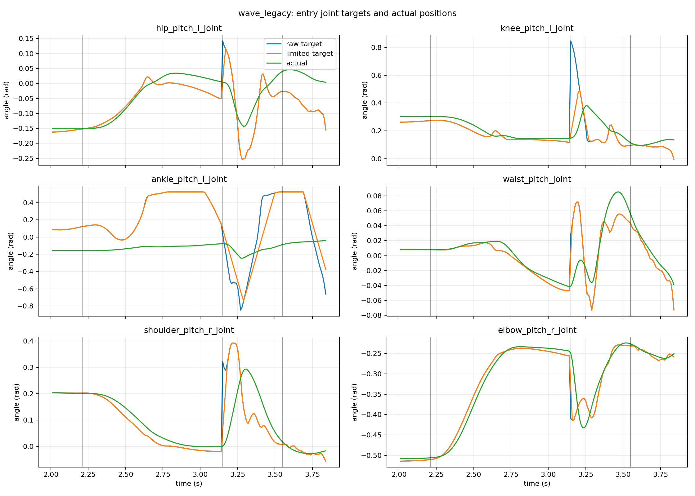
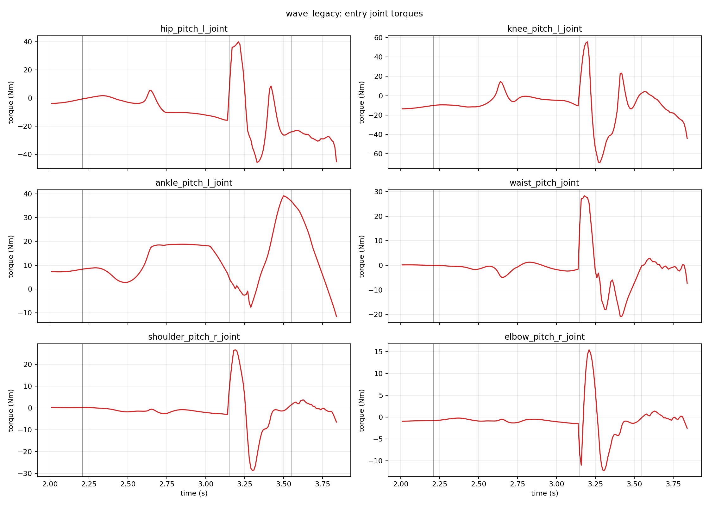
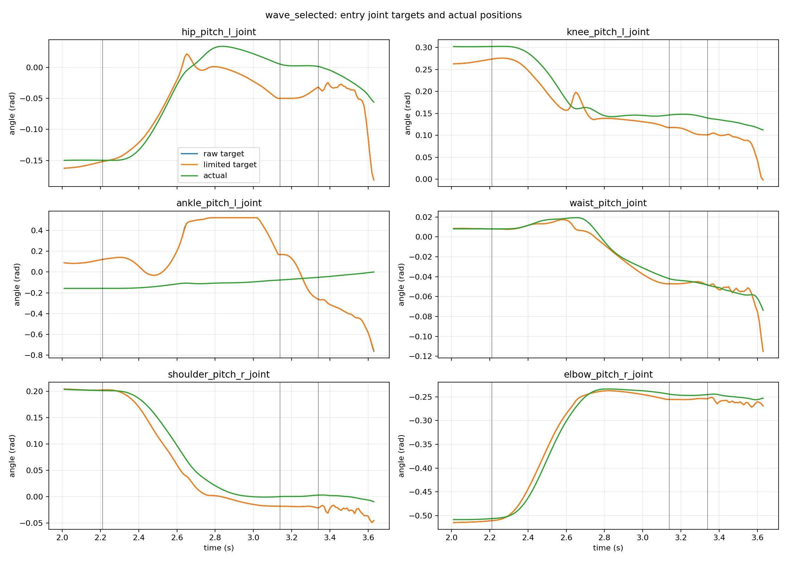
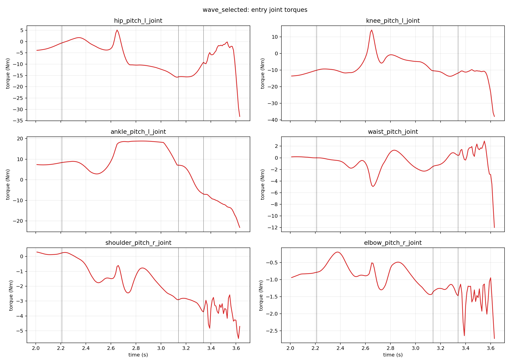

# Phase 3A.2 Smooth Motion Entry

## Scope

This phase changes only the transition from zero-command WALKAMP control into
the two BeyondMimic motions. It does not modify the three ONNX files, EVT2
dynamics, gravity, collision geometry, joint limits, nominal gains, motion
exit logic, or MuJoCo state. The work lives on branch
`feature/smooth-entry-phase3a2`, based on `feature/bow-recovery-phase3a1`.

## Reproduced Cause

The old controller completed `PRE_ALIGN` close to the first BeyondMimic
target, then restarted `TRANSITION_IN` with progress near zero:

```text
PRE_ALIGN end:       blend(WALKAMP, motion, alpha ~= 1)
TRANSITION_IN start: blend(WALKAMP, motion, alpha ~= 0)
```

This reset sent the requested target back toward WALKAMP before moving to the
motion again. The target rate limiter reduced the one-cycle command jump, but
could only spread the incorrect reverse movement over several cycles. Logged
maximum raw target jumps at the stage boundary were 0.8389 rad for bow and
1.3903 rad for wave.

## New Entry Path

Both policies continue inference from live MuJoCo state during entry. The
BeyondMimic reference remains at frame zero until physical handoff completes,
so the action timeline does not run ahead of control ownership.

`PRE_ALIGN` uses endpoint-exact quintic progress. It interpolates joint
positions while retaining WALKAMP gains, feedforward, effort limits, and
torque scale. Existing support, attitude, velocity, and tracking checks remain
active.

At the first `TRANSITION_IN` sample, the controller captures the last target
that actually passed through `TargetRateLimiter`. That complete 29-joint
`ControlTarget` is the new interpolation origin. Position, Kp, Kd,
feedforward, effort limit, and torque scale are all blended to the live
BeyondMimic target with:

```text
alpha(s) = 10*s^3 - 15*s^4 + 6*s^5
```

The first transition sample is exactly the applied anchor and the final sample
is exactly the current motion target. The existing joint target and torque
rate limits remain active. No network actions are mixed, and no `qpos` or
`qvel` is written during handoff.

Three diagnostic modes are available through `--entry-mode`:

- `legacy`: reproduces the old reset for measurement.
- `grouped`: pre-aligns arms while retaining live WALKAMP legs and waist.
- `full_body_continuous`: uses the applied full-body target as one continuous
  origin. This is the selected default.

Per-group transition duration scales are supported in `(0, 1]`. A value below
one completes that group earlier inside the configured transition interval.

## Grouped Versus Full Body

The requested grouped design removed the mathematical boundary jump, but it
left large leg and waist differences to be covered during the short second
stage. That produced worse body motion than the continuous full-body control.
The comparison used `PRE_ALIGN=0.6 s` and `TRANSITION_IN=0.4 s`.

| motion/mode | boundary jump (rad) | target excess travel (rad) | max entry roll/pitch (rad) | max xy speed (m/s) | max joint speed (rad/s) | max torque rate (Nm/s) |
| --- | ---: | ---: | ---: | ---: | ---: | ---: |
| bow legacy | 0.8389 | 1.4571 | 0.0577 | 0.1419 | 4.9262 | 2421.0 |
| bow grouped | 0.0000 | 1.1333 | 0.3985 | 0.6181 | 2.8007 | 1655.6 |
| bow full body | 0.0000 | 0.0051 | 0.0440 | 0.0446 | 0.0525 | 14.7 |
| wave legacy | 1.3903 | 1.6671 | 0.0864 | 0.2058 | 4.2538 | 2042.0 |
| wave grouped | 0.0000 | 1.4926 | 0.1608 | 0.6734 | 4.3605 | 2578.6 |
| wave full body | 0.0000 | 0.4886 | 0.1032 | 0.1560 | 3.6185 | 2306.4 |

The grouped implementation is retained for controlled comparison, but is not
the default because its measured support dynamics are worse.

## Selected Timing

The selected values are:

```text
PRE_ALIGN nominal duration     0.6 s
TRANSITION_IN duration         0.2 s
entry mode                     full_body_continuous
```

`PRE_ALIGN` may remain at its final target while existing safety and tracking
conditions settle. Observed total times were 1.54 s for nominal bow and 0.93 s
for nominal wave. `TRANSITION_IN` took exactly 0.20 s.

The duration sweep showed that longer interpolation was not automatically
smoother. With the selected 0.6/0.2 combination, bow transition joint speed
was 0.0525 rad/s and torque rate was 15.1 Nm/s; wave was 0.2985 rad/s and
72.9 Nm/s. For wave, extending the second stage to 0.4 s raised those values
to 3.6185 rad/s and 2306.4 Nm/s because the changing live motion target and
robot dynamics had more time to diverge during handoff.

## Curves

Vertical markers show the start of PRE_ALIGN, TRANSITION_IN, and MOTION. Each
angle plot contains the raw requested target, rate-limited target, and measured
joint position for a representative hip, knee, ankle, waist, shoulder, and
elbow.

### Bow

Legacy entry target reset:





Selected continuous entry:





### Wave

Legacy entry target reset:





Selected continuous entry:





Machine-readable analysis JSON files can be reproduced with
`scripts/analyze_smooth_entry.py`.

## Continuous-State Tests

Every repeated scenario ran in one continuous MuJoCo state. There was no reset
between commands.

| scenario | result | completed | failed/rejected | minimum root z | torque saturation |
| --- | --- | ---: | ---: | ---: | ---: |
| wave then bow | PASS | 2/2 | 0 | 0.9484 m | 0% |
| bow then wave | PASS | 2/2 | 0 | 0.9457 m | 0% |
| 20 waves | PASS | 20/20 | 0 | 0.9463 m | 0% |
| 20 bows | PASS | 20/20 | 0 | 0.9446 m | 0% |
| 20 alternating motions | PASS | 20/20 | 0 | 0.9448 m | 0% |

At every selected PRE_ALIGN to TRANSITION_IN boundary, the measured raw and
limited position target jumps and Kp, Kd, and feedforward jumps were zero for
legs, waist, and arms.

## Exit Recovery Regression

The Phase 3A.1 exit/recovery code was not changed. Its full duration, gait
phase, initial offset, perturbation, and continuous 20-bow suite passed. The
20-bow scenario completed 20/20 without reset and had 0% torque saturation.

Entry changes alter the physical state from which the same motion trajectory
starts, so recovery metrics are not numerically identical. Nominal forward
recovery displacement changed from the Phase 3A.1 report's 0.0086 m to
0.0621 m, while the repeated 20-bow mean improved from 0.0332 m to 0.0029 m.
The repeated regression observed 2/20 single-foot takeover samples versus
1/20 in the previous report. No falls or failed recoveries occurred. This is a
mixed dynamics change, not evidence that exit behavior is identical.

## Reproduction

Install plotting support if needed:

```bash
python -m pip install -e '.[analysis]'
```

Run the complete entry comparison, duration sweep, and continuous tests:

```bash
python scripts/run_smooth_entry_suite.py \
  --config configs/multi_evt2.json \
  --output-dir artifacts/smooth_entry_phase3a2
```

Run one visual simulation with the selected defaults:

```bash
python run_multi_evt2.py --config configs/multi_evt2.json
```

Run a diagnostic mode directly:

```bash
python run_multi_evt2.py \
  --config configs/multi_evt2.json \
  --scenario bow \
  --entry-mode legacy \
  --headless --no-realtime
```

Analyze and plot any CSV:

```bash
python scripts/analyze_smooth_entry.py \
  artifacts/smooth_entry_phase3a2/bow_selected.csv \
  --output-dir artifacts/smooth_entry_analysis \
  --label bow_selected
```

Regression commands:

```bash
python -m pytest -q
python scripts/run_bow_recovery_suite.py --config configs/multi_evt2.json
python scripts/run_multi_evt2_headless_suite.py --config configs/multi_evt2.json
python scripts/run_walkamp_headless_suite.py --config configs/walkamp_official.json
python scripts/run_motion_evt2_headless_suite.py --config configs/motion_evt2.json
```

The two open-loop reference cases in the final command remain expected
diagnostic failures. Both real BeyondMimic policy cases pass their full
trajectories.

## Remaining Limit

These are deterministic MuJoCo results for the tested initial states and small
perturbations. They are not a real-robot safety certification. Hardware use
still requires joint-level command, gain, timing, communication watchdog,
contact estimation, and emergency-stop validation.
