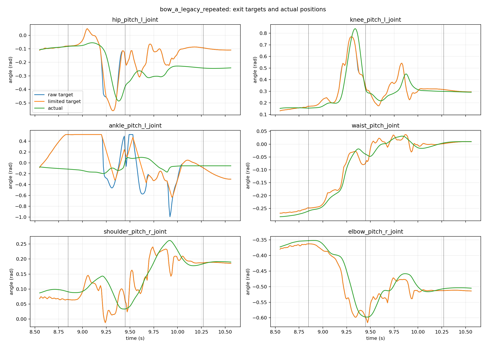
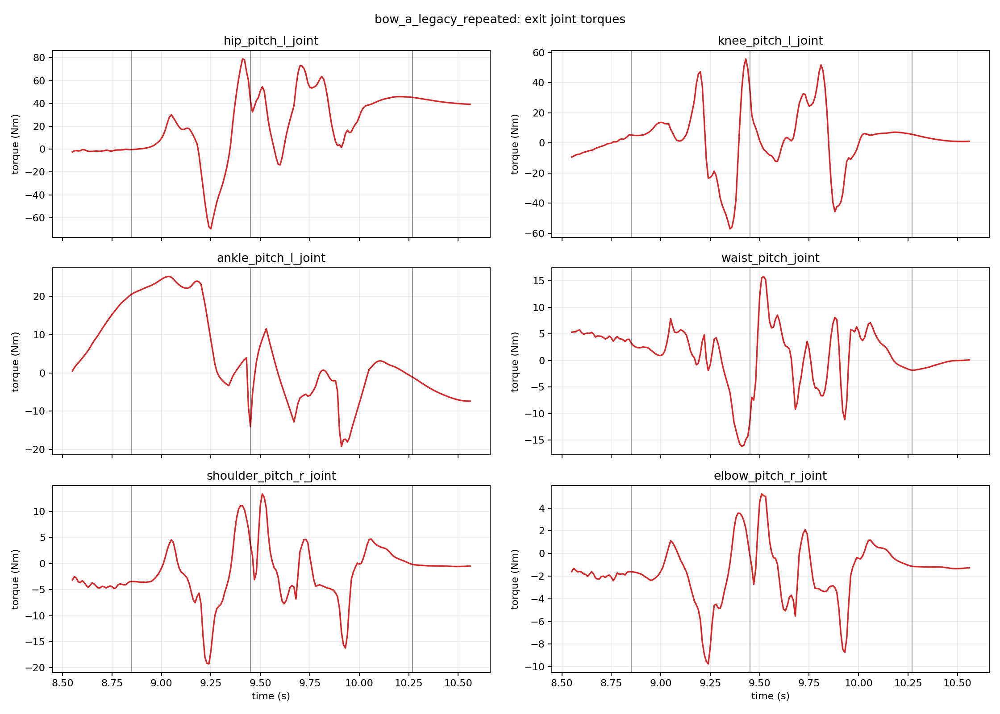
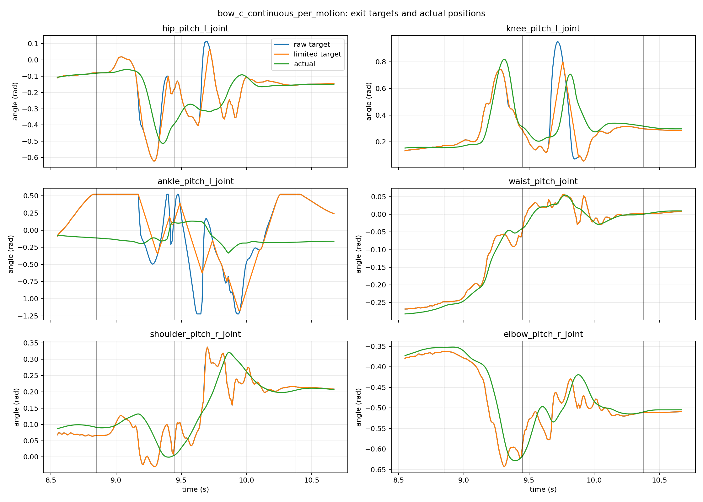
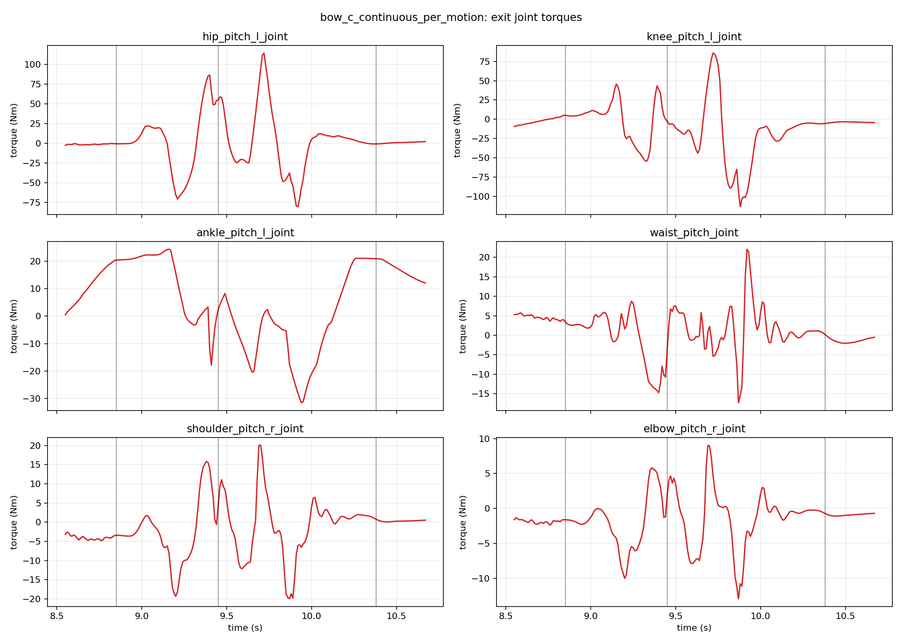
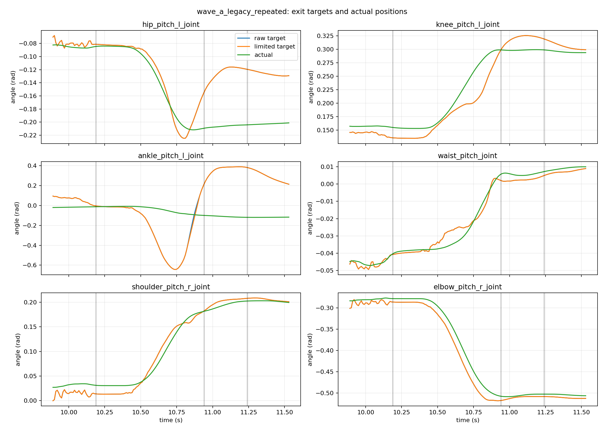
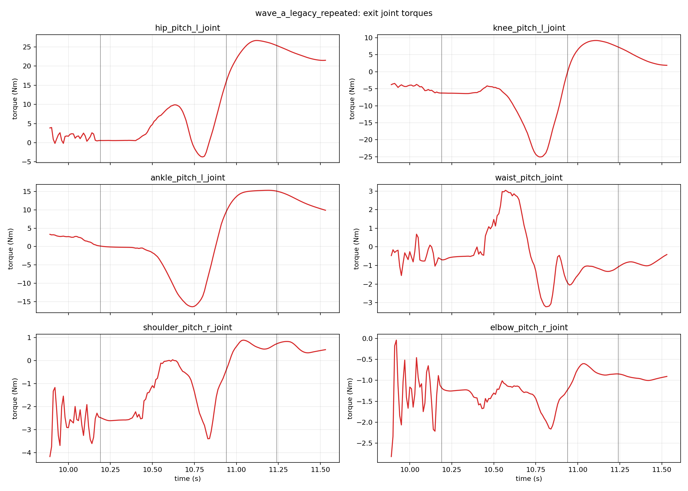
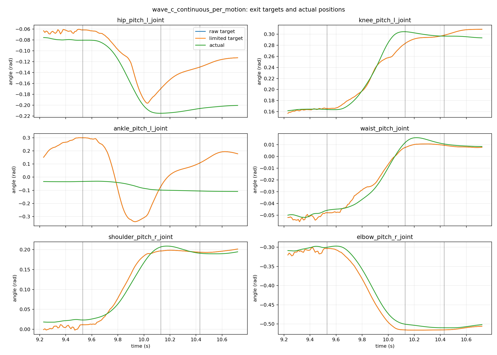
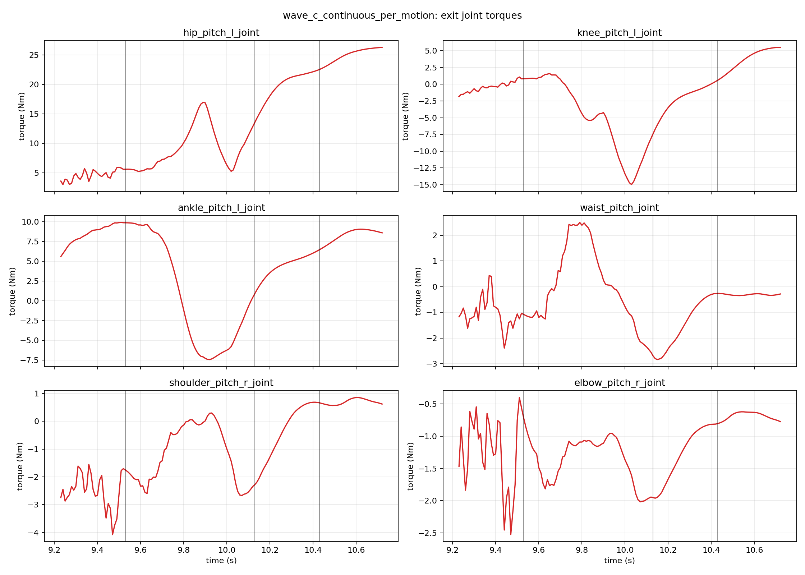

# Phase 3A.3 Smooth Motion Exit

## Scope

This phase changes only the online handoff from a BeyondMimic motion back to
zero-command WALKAMP. It preserves the Phase 3A.1 early-exit safety checks,
the Phase 3A.2 continuous entry path, all ONNX files, the official EVT2 model,
dynamics, gravity, collisions, limits, and nominal gains. No handoff writes
MuJoCo `qpos` or `qvel`.

Development branch: `feature/smooth-exit-phase3a3`, based on
`feature/smooth-entry-phase3a2`.

## Baseline Diagnosis

The Phase 3A.2 exit started each blend from the current BeyondMimic target,
not from the last complete target that had passed through `TargetRateLimiter`.
It also rebuilt WALKAMP from one repeated observation and a configured gait
phase. Making only the target boundary continuous did not fix the bow:

| case | boundary q jump | acquisition xy speed | acquisition joint speed | planar recovery displacement | support at acquisition |
| --- | ---: | ---: | ---: | ---: | --- |
| Bow A: legacy + repeated history | 0.0010 rad | 0.2656 m/s | 5.5595 rad/s | 0.0697 m | single foot |
| Bow B: continuous + repeated history | 0.0000 rad | 0.3044 m/s | 6.2487 rad/s | 0.0655 m | single foot |
| Bow C: continuous + measured history | 0.0000 rad | 0.1432 m/s | 1.5228 rad/s | 0.0526 m | both feet |
| Wave A: legacy + repeated history | 0.0001 rad | 0.0979 m/s | 0.2773 rad/s | 0.0288 m | both feet |
| Wave C: continuous + selected phase | 0.0000 rad | 0.0314 m/s | 0.3077 rad/s | 0.0125 m | both feet |

This isolates two causes. The old boundary had a small command discontinuity,
but bow behavior was dominated by WALKAMP state reconstruction. Wave behaves
better with repeated history; measured history is therefore not enabled for
every motion.

## Continuous Exit

At the first real interpolation cycle, the controller captures the previous
rate-limited 29-joint `ControlTarget`. This anchor includes position, Kp, Kd,
feedforward, effort limits, and torque scale. Both source and destination
policies continue to observe current MuJoCo state during handoff.

The source-policy change is admitted only inside the transition, while the
quintic weight guarantees exact endpoints:

```text
alpha(s) = 10*s^3 - 15*s^4 + 6*s^5
live_source = anchor + alpha * (motion_live - motion_start)
target = (1 - alpha) * live_source + alpha * walkamp_live
```

At `s=0`, every ControlTarget field exactly equals the last applied anchor.
At `s=1`, every field exactly equals the current WALKAMP target. Existing
joint-target and torque slew limits remain active. Network actions are never
mixed directly.

The measured-history option records ten real control cycles: base angular
velocity, projected gravity, joint position, joint velocity, and the target
actually sent during each cycle. It does not insert unexecuted preview actions.
Candidate phase preview runs ONNX inference without mutating formal WALKAMP
history, actions, timer, target, or MuJoCo state.

## Selected Settings

The physical sweep covered all eight gait phases, exit durations of 0.2, 0.3,
0.4, and 0.6 seconds, and wave tail windows of 0, 0.4, 0.6, and 0.8 seconds.

| motion | history | phase time | exit duration | early window |
| --- | --- | ---: | ---: | ---: |
| bow | measured | 0.31875 s | 0.6 s | final 0.8 s |
| wave | repeated | 0.31875 s | 0.6 s | final 0.8 s |

Bow and wave use the same selected phase but intentionally use different
history initialization. The wave reference after the selected handoff changes
by at most 0.0084 rad at any joint and about 2 mm at the pelvis, so the main
gesture is not cut off. The corresponding bow tail spans 0.0428 rad and 10 mm;
its early window is retained from Phase 3A.1 and remains gated by live state.

Hard-gating bow with the first WALKAMP preview target was tested and failed:
the neutral-tuned handoff thresholds never became continuously valid and the
robot reached terminal failure. Preview remains diagnostic; it does not
replace the verified posture, velocity, and contact safety gate.

## Dynamic Results

The selected single runs completed with zero torque saturation and no loss of
support at WALKAMP acquisition. The complete ControlTarget boundary jumps for
q, Kp, Kd, feedforward, effort, and torque scale were all zero.

The result is not uniformly better for every peak. Bow's full transition peak
joint speed was 9.49 rad/s versus 7.36 rad/s in legacy, while its speed at full
WALKAMP acquisition dropped from 5.56 to 1.52 rad/s. Peak acceleration was
668 versus 559 rad/s2, tracking error was 0.788 versus 0.816 rad, and torque
rate was 2933 versus 3058 Nm/s. The measured-history change improves the state
at takeover, but it does not remove all transient motion earlier in the blend.

Wave's selected transition peak joint speed was 0.94 rad/s, acceleration was
15.7 rad/s2, tracking error was 0.498 rad, and torque rate was 179 Nm/s. The
legacy values were 0.92 rad/s, 18.8 rad/s2, 0.575 rad, and 167 Nm/s. This is
also a mixed result rather than a claim that every scalar metric improved.

Support-edge counting shows a remaining limitation. The selected bow run had
three single-support entries after WALKAMP acquisition versus one in the
legacy run, although takeover speed and displacement were lower. Across 20
continuous bows there were 64 recovery single-support entries. Wave had zero
in both its single run and 20-run sequence. These events are support-state
edges, not guaranteed full strides, but they show that bow recovery stepping
has not been eliminated.

## Curves

Vertical markers show `TRANSITION_OUT`, `RECOVER`, and recovery completion.
Angle plots include raw target, rate-limited target, and measured position.

### Bow









### Wave









## Continuous-State Tests

No scenario resets MuJoCo between commands.

| scenario | result | completed | falls | acquisition single support | recovery step events | mean planar exit displacement |
| --- | --- | ---: | ---: | ---: | ---: | ---: |
| 20 bows | PASS | 20/20 | 0 | 0 | 64 | 0.0453 m |
| 20 waves | PASS | 20/20 | 0 | 0 | 0 | 0.0094 m |
| 20 alternating | PASS | 20/20 | 0 | 0 | 30 | 0.0293 m |

All six configured initial/tail perturbation scenarios passed. Minimum root
height was 0.9444 m across the long alternating run and torque saturation was
0%. The original Phase 3A.1, Phase 3A.2, independent motion, multi-policy, and
WALKAMP suites are part of the regression procedure below.

A compact machine-readable copy of the selected comparison is stored in
[`docs/data/phase3a3_results.json`](data/phase3a3_results.json).

## Reproduction

Run the complete A/B/C, phase, duration, early-window, perturbation, and
continuous-state suite:

```bash
python scripts/run_smooth_exit_suite.py \
  --config configs/multi_evt2.json \
  --output-dir artifacts/smooth_exit_phase3a3
```

Run one selected visual simulation:

```bash
python run_multi_evt2.py --config configs/multi_evt2.json
```

Reproduce the Phase 3A.2 baseline exit:

```bash
python run_multi_evt2.py \
  --config configs/multi_evt2.json \
  --scenario bow \
  --exit-mode legacy \
  --exit-history repeated \
  --reentry-phase 0.2125 \
  --transition-out 0.6 \
  --headless --no-realtime
```

Analyze any generated summary and CSV:

```bash
python scripts/analyze_smooth_exit.py \
  artifacts/smooth_exit_phase3a3/bow_c_continuous_per_motion_summary.json \
  --csv artifacts/smooth_exit_phase3a3/bow_c_continuous_per_motion.csv \
  --output-dir artifacts/smooth_exit_analysis
```

## Remaining Limit

WALKAMP is a cyclic walking controller even at zero command. Its initial output
depends on gait phase and history, and bow's terminal dynamic state is not a
true WALKAMP standing state. Continuous interpolation can reduce command
discontinuity and takeover motion, but cannot make these state distributions
identical.

The next principled step is a separately verified READY/Stand balance policy
between BeyondMimic and WALKAMP, or a trained recovery tail for the bow. An
ever-longer interpolation is not recommended. These deterministic MuJoCo
tests are not real-robot safety certification.
