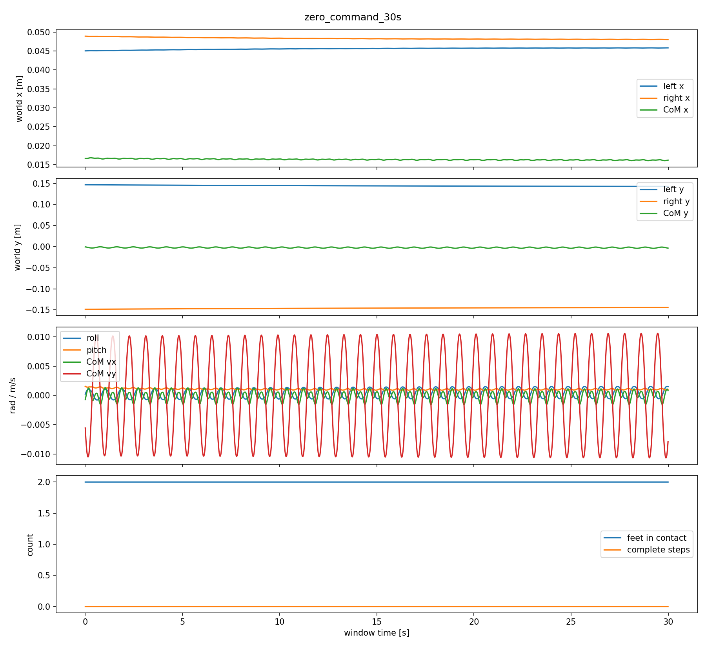
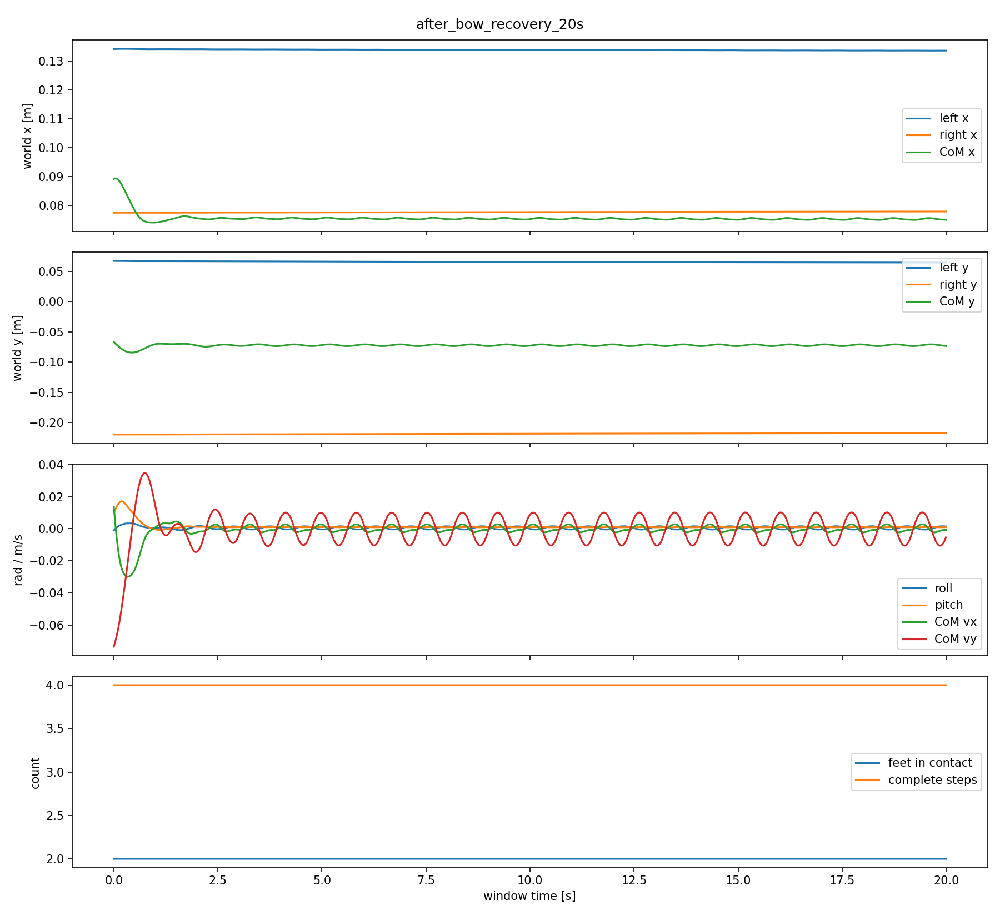
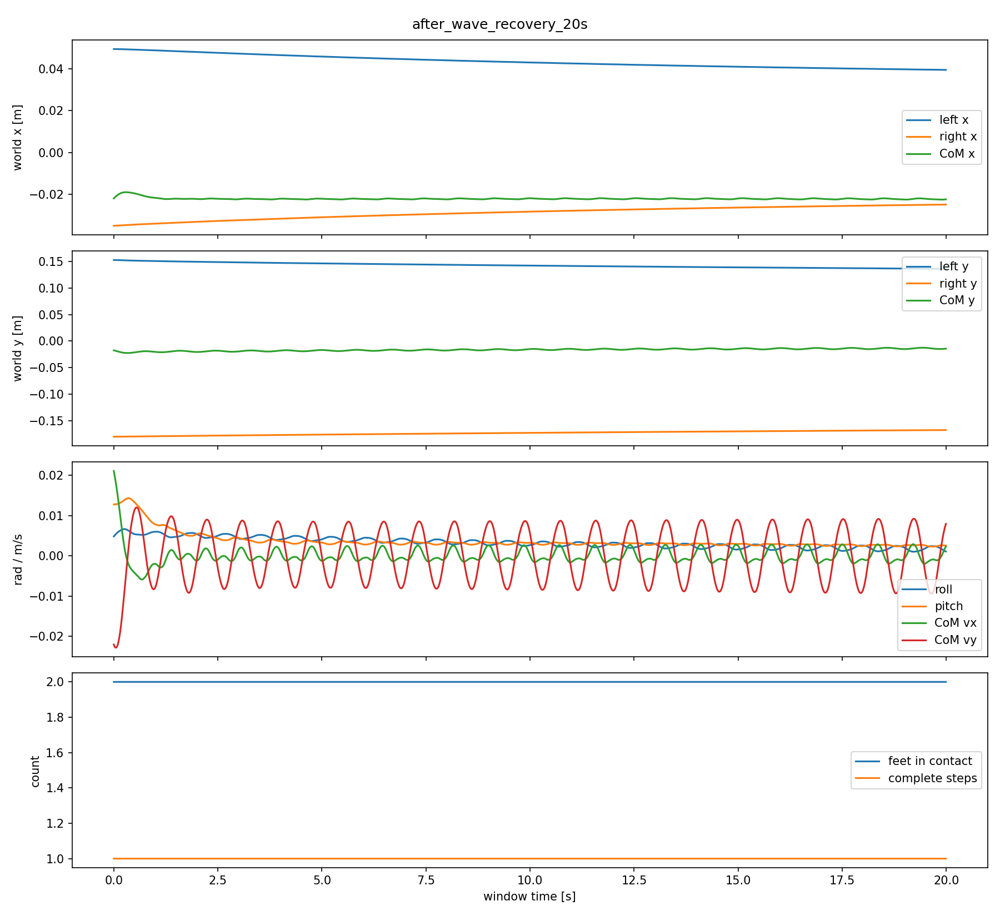

# Phase 3A.4: Stand / READY diagnostics

Branch: `feature/stand-ready-phase3a4`

This phase diagnoses residual stepping after BeyondMimic actions. It does not
change any ONNX file, robot dynamics, gravity, collision geometry, joint limit,
or the default Phase 3A.3 control path.

## Result

WALKAMP does not show periodic stepping when started from the standard pose with
a zero velocity command. It completed the 30 s window with zero contact edges
and zero complete steps. Both feet moved by about 4 mm and the CoM moved by
3.0 mm.

After a forward-walk command was set to zero, WALKAMP made four stopping steps
within 0.82 s. It then remained in double support for the rest of the 30 s
window. These are stopping steps, not persistent zero-command stepping.

| Measurement window | Complete steps | Contact edges | Foot drift L / R | CoM drift | Max CoM speed |
| --- | ---: | ---: | ---: | ---: | ---: |
| Zero command, 30 s | 0 | 0 | 0.0040 / 0.0042 m | 0.0030 m | 0.0107 m/s |
| Walk then stop, 30 s | 4 | 7 | 0.2630 / 0.2106 m | 0.1918 m | 0.4694 m/s |
| Wave recovery complete, 20 s | 0 | 0 | 0.0194 / 0.0161 m | 0.0032 m | 0.0305 m/s |
| Bow recovery complete, 20 s | 0 | 0 | 0.0027 / 0.0024 m | 0.0156 m | 0.0747 m/s |

The bow difference occurs before recovery is declared complete:

| Motion | TRANSITION_OUT steps | WALKAMP RECOVER steps | Post-recovery steps |
| --- | ---: | ---: | ---: |
| Bow | 1 | 3 | 0 |
| Wave | 0 | 0 | 0 |

During bow exit, peak CoM speed was 0.2600 m/s in `TRANSITION_OUT` and
0.2097 m/s in `RECOVER`. Peak pitch reached 0.1047 rad in recovery. The robot
therefore enters a real dynamic recovery condition; the adjustment is not a
contact-counter artifact and does not continue once balance is recovered.

## Step definition

A contact transition is not counted as a step. A complete step requires all of:

- a foot flight interval of at least 0.04 s;
- at least 0.025 m horizontal movement from takeoff to landing;
- contact maintained for at least 0.04 s after landing.

Raw contact edges, single-support time, and complete steps remain separate in
the CSV and JSON outputs.

## Continuous tests

All tests below use one continuous MuJoCo physical state. There is no reset
between actions.

| Scenario | Completed actions | Falls | Complete steps | Contact edges |
| --- | ---: | ---: | ---: | ---: |
| 20 bows | 20 / 20 | 0 | 78 | 192 |
| 20 waves | 20 / 20 | 0 | 1 | 4 |
| 20 alternating actions | 20 / 20 | 0 | 46 | 102 |

The 20-bow run stayed above 0.945 m root height, but the left and right feet
ended about 0.92 m and 0.52 m from their initial planar positions. Stability is
therefore preserved, while stationary recovery quality remains unsatisfactory.

## READY interface

`ControllerState.READY` and `ReadyController` are now reserved in the state
machine. The only accepted implementation is `walkamp_feedback`, which keeps
the existing tested WALKAMP closed loop active and returns a complete 29-joint
`ControlTarget`. An unknown controller such as a fixed-pose placeholder is
rejected.

READY is disabled in `configs/multi_evt2.json`. With it disabled, the state
path and output remain identical to Phase 3A.3. Enabling the WALKAMP READY
baseline did not reduce bow's four exit/recovery steps, so it is not enabled in
the formal demo.

The official Deploy_Tienkung branch-3.0 source at commit
`9786cf1a7ed9e3bead1a8de47ed6a5c251cb1869` was checked. Its STOP state stores
the entry joint pose and holds it with PD; BeyondZero interpolates to a fixed
29-joint pose. The branch contains WALKAMP, BeyondMimic, and another motion
ONNX, but no separate closed-loop EVT2 Stand Policy. STOP and BeyondZero are not
treated as verified balance controllers.

Official references:

- <https://github.com/Open-X-Humanoid/Deploy_Tienkung/tree/3.0>
- <https://github.com/Open-X-Humanoid/xSIM_MUJOCO>

## Recommendation

An independent Stand Policy is not required to solve ordinary zero-command
standing: WALKAMP already holds that condition in this model. Extending the
current interpolation or inserting an extra READY wait also does not remove the
bow recovery steps.

If stationary bow recovery is a hard requirement, train a short closed-loop
READY/Recovery Policy rather than replacing WALKAMP idle globally:

1. Use the same official EVT2 model, 29-joint mapping, motor torque interface,
   control period, gains, effort limits, and observation conventions.
2. Seed resets from measured bow tail and exit states, WALKAMP stopped states,
   wave terminal states, and small pose/velocity perturbations. Include the
   actual Phase 3A.4 states in the reset dataset.
3. Reward double-foot support, low foot slip and foot displacement, CoM velocity
   reduction, bounded roll/pitch and angular velocity, smooth target/torque
   changes, and successful transition into WALKAMP's verified takeover set.
4. Keep stepping available and penalize only unnecessary steps. Do not lock the
   feet or root.
5. Export explicit metadata for joint names, observation order/history, action
   scale, gains, period, and limits. Adapt its output to the same complete
   29-joint `ControlTarget` interface.
6. Require the same 20-bow, 20-wave, and alternating no-reset suite, plus push
   disturbances and model randomization, before setting `ready.enabled=true`.

## Reproduce

Run the four long-window diagnostics and continuous tests:

```bash
python scripts/run_stand_ready_suite.py
```

Run only the four diagnostics and WALKAMP READY comparison:

```bash
python scripts/run_stand_ready_suite.py --quick
```

Run an individual case:

```bash
python run_multi_evt2.py \
  --config configs/multi_evt2.json \
  --scenario bow_return_20 \
  --headless --no-realtime \
  --log artifacts/bow_return_20.csv \
  --summary artifacts/bow_return_20_summary.json
```

Generated outputs are under `artifacts/stand_ready_phase3a4/`. Compact checked-in
data and representative curves are under `docs/data/` and
`docs/images/phase3a4/`.






